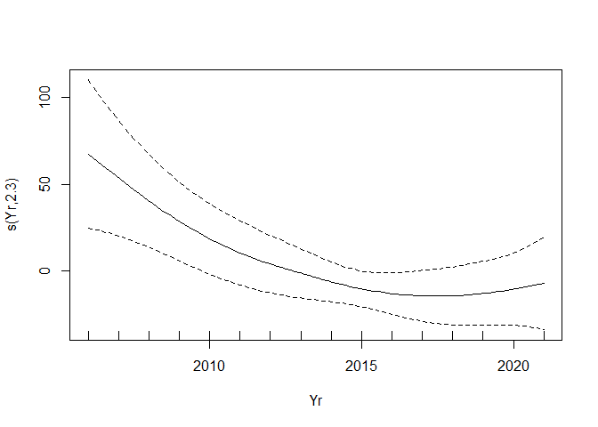
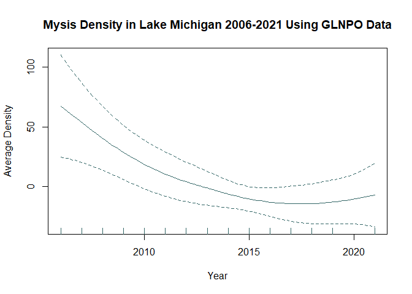
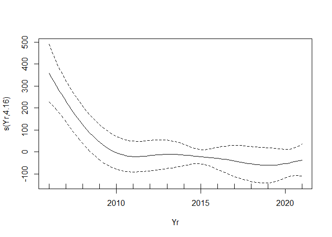

RMarkdown for Initial Mysis GAM
================
Sarah Lawhun
2023-01-31

**1. Load mgcv package `library(mgcv)`** <br> **2. Read GLNPO csv (for
this test, I have already filtered to just Lake Michigan Data).Take a
look at the column names.**

``` r
GLNPO <- read.csv("C:\\Users\\sarah\\Documents\\Cornell\\Mysid Data\\GAM\\Step5_OutputByStation.csv")

colnames(GLNPO)
```

    ##  [1] "Species"         "Survey"          "Lake"            "Station"        
    ##  [5] "MaxOfReplicate"  "AvgDens"         "MinAvgDens"      "MaxAvgDens"     
    ##  [9] "AvgBmss_mg"      "MinAvgBmss"      "MaxAvgBmss"      "AvgOfLatitude"  
    ## [13] "AvgOfLongitude"  "Station_Depth_m" "Year_"           "Date_Visit"     
    ## [17] "Season"          "DayNite"         "AvgOfAvL"        "MinOfAvL"       
    ## [21] "MaxOfAvL"        "AvgOfAVW"        "MinOfAVW"        "MaxOfAVW"

**3. Identify variables of interest for GAM:**

``` r
Yr <- GLNPO$Year_
Dens <- GLNPO$AvgDens
Bmss <- GLNPO$AvgBmss_mg
```

**4. Run your GAM with x(Yr) and y(Dens) and view the summary
information for the plot:**

``` r
DensGAM <- gam(Dens ~ s(Yr))
summary(DensGAM)
```

    ## 
    ## Family: gaussian 
    ## Link function: identity 
    ## 
    ## Formula:
    ## Dens ~ s(Yr)
    ## 
    ## Parametric coefficients:
    ##             Estimate Std. Error t value Pr(>|t|)    
    ## (Intercept)   91.870      6.377   14.41   <2e-16 ***
    ## ---
    ## Signif. codes:  0 '***' 0.001 '**' 0.01 '*' 0.05 '.' 0.1 ' ' 1
    ## 
    ## Approximate significance of smooth terms:
    ##       edf Ref.df     F p-value  
    ## s(Yr) 2.3   2.81 3.696  0.0129 *
    ## ---
    ## Signif. codes:  0 '***' 0.001 '**' 0.01 '*' 0.05 '.' 0.1 ' ' 1
    ## 
    ## R-sq.(adj) =  0.0412   Deviance explained = 5.07%
    ## GCV = 9610.7  Scale est. = 9474.6    n = 233

**5. Plot a basic version of your GAM: `plot(DensGAM)`** <br>

<!-- -->
<br> <br>

Kind of plain, womp womp

<br> <br>

**6. Spice the plot up**

<br>

<!-- -->

<br> <br>

I added x and y labels, a title, and a color. I want to add more soon

**7. Run your GAM with x(Yr) and y(Bmss) and view the summary
information for the plot:**

``` r
BmssGAM <- gam(Bmss ~ s(Yr))
summary(BmssGAM)
```

    ## 
    ## Family: gaussian 
    ## Link function: identity 
    ## 
    ## Formula:
    ## Bmss ~ s(Yr)
    ## 
    ## Parametric coefficients:
    ##             Estimate Std. Error t value Pr(>|t|)    
    ## (Intercept)   209.76      15.74   13.33   <2e-16 ***
    ## ---
    ## Signif. codes:  0 '***' 0.001 '**' 0.01 '*' 0.05 '.' 0.1 ' ' 1
    ## 
    ## Approximate significance of smooth terms:
    ##        edf Ref.df     F  p-value    
    ## s(Yr) 4.16  5.053 6.336 1.56e-05 ***
    ## ---
    ## Signif. codes:  0 '***' 0.001 '**' 0.01 '*' 0.05 '.' 0.1 ' ' 1
    ## 
    ## R-sq.(adj) =  0.116   Deviance explained = 13.2%
    ## GCV =  58760  Scale est. = 57453     n = 232

<br> **8. Plot biomass GAM `plot(BmssGAM)`:**
<!-- -->
